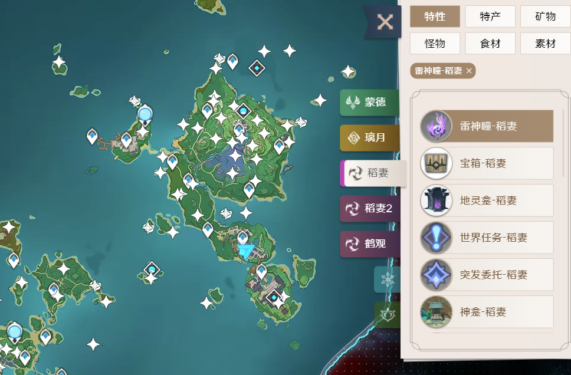

# 原神地图跟踪

* 功能：网页空莹酒馆地图与游戏玩家位置同步跟踪

# 用法：
* 1.导入GenshinImpactMapTrack/Tampermonkey script.user.js脚本到油猴
* 2.安装 [.NET6](https://dotnet.microsoft.com/download/dotnet/thank-you/sdk-6.0.100-windows-x64-installer)
* 3.运行 `dotnet dev-certs https --trust`
* 3.进入 GenshinImpactMapTrack\GenshinImpactMapTrack 目录运行  `dotnet run`
* 4.打开https://yuanshen.site/

# 该项目离不开以下项目的支持：
* https://github.com/GengGode/GenshinImpact_AutoTrack_DLL
